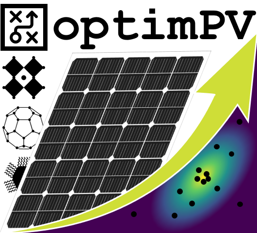

|

optimPV: Optimization & Modeling Tools for PV Research
======================================================

|
|

Welcome to the optimPV documentation!

Authors
-------
- `Vincent M. Le Corre <https://github.com/VMLC-PV>`_
- `Larry Lüer <https://github.com/larryluer>`_

Institution
-----------

   
CAPE - Centre for Advanced Photovoltaics and Thin-film Energy Devices, University of Southern Denmark, Denmark

Description
-----------
This repository contains the code to run optimPV. optimPV combines several optimization procedures and modeling utilities used to:
 
1. Optimize simulation parameters to fit experimental data.
2. Optimize the processing conditions in a self-driving experimental set-up.

Installation
------------
With pip:
~~~~~~~~~
- Install from PyPI:

  .. code-block:: bash

      pip install optimpv

- Or install from GitHub:

  .. code-block:: bash

      pip install git+https://github.com/openPV-lab/optimPV

With conda:
~~~~~~~~~~~
.. code-block:: bash

    conda create -n optimpv 
    conda activate optimpv
    pip install optimpv

To clone your base environment:

.. code-block:: bash

    conda create -n optimpv --clone base

Additional Necessary Installs for the Agents
---------------------------------------------
Drift-diffusion agent:
~~~~~~~~~~~~~~~~~~~~~~
The drift-diffusion agent uses SIMsalabim to run simulations.

- SIMsalabim is included as a submodule.
- Install it following the instructions on the SIMsalabim GitHub repository.
- Only works for parallel simulations on Linux (all other agents work on Windows).

Parallel simulations:
~~~~~~~~~~~~~~~~~~~~~
To run parallel simulations on Linux, install GNU Parallel:

  .. code-block:: bash

      sudo apt update
      sudo apt install parallel

Disclaimer
----------
This repository is still under development. If you find any bugs or have any questions, please contact us.

.. toctree::
   :maxdepth: 2
   :caption: Drift-diffusion:

   ../examples/JV_realOPV.ipynb
   ../examples/JV_fakePerovskite.ipynb
   ../examples/MO_hysteresis_fakePerovskite.ipynb
   ../examples/MO_JV_impedance_fakePerovskite.ipynb
   ../examples/Approx_posterior.ipynb
   ../examples/Lazy_posterior_degradation.ipynb
   ../examples/Lazy_posterior_realOPV.ipynb
   Notebook_gallery_DD

.. toctree::
   :maxdepth: 2
   :caption: Transfer Matrix:

   ../examples/TransferMatrix.ipynb

.. toctree::
   :maxdepth: 2
   :caption: Rate equation models:

   ../examples/TAS.ipynb
   ../examples/MO_trPL_trMC.ipynb
   ../examples/TrPL_diff.ipynb

.. toctree::
   :maxdepth: 2
   :caption: Design of experiments:

   ../examples/Exp_design.ipynb
   ../examples/Exp_design_turbo.ipynb
   ../examples/Exp_design_MOO.ipynb
   ../examples/Exp_design_MOO_pymoo.ipynb

.. toctree::
   :maxdepth: 2
   :caption: Non-ideal diode models:

   ../examples/diode.ipynb

.. toctree::
   :maxdepth: 2
   :caption: Notebook gallery:

   Notebook_gallery

.. toctree::
   :maxdepth: 2
   :caption: API:

   change_log
   modules
